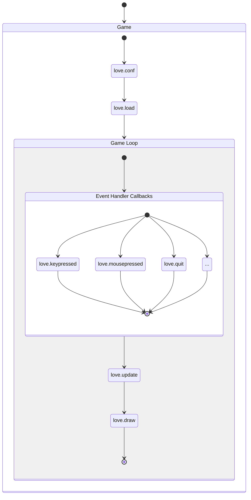

## !!steps Before we start

```bash !console
git clone https://github.com/Kyonru/creating-games-with-love-demo.git
```

### !!tabs rules.lua

```lua !
-- Performance and good practices are not the focus here.
-- Make it work, then make it pretty.
-- Keep it "simple" and fun.
-- Use the repo as a reference.
```

## !!steps Let's start!

<span>
  <u>love.conf</u> and <u>love.load</u>{" "}
  are invoked at the start of every game,
  exactly once per game. This is the
  perfect place to setup and load game
  components.

The functions inside the <u>Game Loop</u> are invoked every frame in that order. The <u>Event Handler Callbacks</u> are processed before the update function, but their execution order depends on when each event is triggered.

Learn more about it [here](https://www.love2d.org/wiki/love).

</span>

```bash !console
git checkout f324ecefdb6737aeb2415d63b3b3e10b97d12a0b
```



### !!tabs main.lua

```lua !
function love.load()
end

function love.update(dt)
end

function love.draw()
end
```

### !!tabs player.lua

```lua !
local player = {}

function player.load()
end

function player.update(dt)
end

function player.draw()
end

return player
```

### !!tabs main.lua (updated)

```lua !
-- !diff +
local player = require("player")

function love.load()
-- !diff +
  player.load()
end

function love.update(dt)
-- !diff +
  player.update(dt)
end

function love.draw()
-- !diff +
  player.draw()
end
```

## !!steps Draw something! 1/3

Running our game would not show anything yet. Let's draw something simple.

### !!tabs player.lua

```lua !
local player = {}

function player.load()
end

function player.update(dt)
end

function player.draw()
end

return player
```

## !!steps Draw something! 2/3

Initialize the player's basic attributes like its position, size, and sprite. So it can be drawn on the screen.


### !!tabs player.lua

```lua !
local player = {}

-- !diff(1:3) +
local PLAYER_SPRITES = {
  IDLE = love.graphics.newImage('assets/player/idle.png'),
}

function player.load()
  -- !diff(1:5) +
  player.sprite = PLAYER_SPRITES.IDLE
  player.x = 100
  player.y = 100
  player.width = 64
  player.height = 64
end
```

## !!steps Draw something! 3/3

Now we'll render our player on the screen by drawing its sprite and visualizing its hitbox with a rectangle.

```bash !console
git checkout 7a15081291986d44c75de25f431379a5c15677a3
```

### !!tabs player.lua

```lua !
function player.draw()
  -- !diff(1:11) +
  love.graphics.rectangle("line", player.x, player.y, player.width, player.height)
  love.graphics.draw(
    player.sprite,
    player.x,
    player.y,
    0, -- rotation angle,  from 0 to tau
    player.width/player.sprite:getWidth(), -- scale x
    player.height/player.sprite:getHeight(), -- scale y
    0, -- offset x
    32 -- offset y (to center this specific sprite)
  )
end
```

## !!steps Moving the player 1/5

Let's read keyboard input to move the player around. This method directly updates the player's position, which works but can feel a bit abrupt or “janky” without smoothing.

```bash !console
git checkout b3b5f29a6af5e8675a3743b115ff91981061ee3f
```

### !!tabs player.lua

```lua !
function player.update(dt)
-- !diff(1:4) +
  local left = love.keyboard.isDown("left")
  local right = love.keyboard.isDown("right")
  local up = love.keyboard.isDown("up")
  local down = love.keyboard.isDown("down")

-- !diff(1:3) +
  if left then
    player.x = player.x - 100 * dt
  end

-- !diff(1:3) +
  if right then
    player.x = player.x + 100 * dt
  end

-- !diff(1:3) +
  if up then
    player.y = player.y - 100 * dt
  end

-- !diff(1:3) +
  if down then
    player.y = player.y + 100 * dt
  end
end
```

## !!steps Moving the player 2/5

We want our player — an astronaut — to move freely through space, rather than just snapping to arrow key inputs.

### !!tabs player.lua

```lua !
function player.load()
  player.sprite = PLAYER_SPRITES.IDLE
  player.x = 100
  player.y = 100
  player.width = 64
  player.height = 64
end
```

## !!steps Moving the player 3/5

To achieve smooth movement, we'll define a speed and a velocity for the player. This lets us control movement continuously and handle directions more naturally.

### !!tabs player.lua

```lua !
function player.load()
  player.sprite = PLAYER_SPRITES.IDLE
  player.x = 100
  player.y = 100
  player.width = 64
  player.height = 64
  -- !diff(1:2) +
  player.speed = 3
  player.velocity = { x = 0, y = 0 }
end

function player.update(dt)
end
```

## !!steps Moving the player 4/5

Instead of updating the player's position directly, we'll now update the player's velocity based on input.

### !!tabs player.lua

```lua !
function player.update(dt)
  local left = love.keyboard.isDown("left")
  local right = love.keyboard.isDown("right")
  local up = love.keyboard.isDown("up")
  local down = love.keyboard.isDown("down")

  if left then
    -- !diff[27:29] -
    player.x = player.x - 100 * dt
  end

  if right then
    -- !diff[27:29] -
    player.x = player.x + 100 * dt
  end

  if up then
    -- !diff[27:29] -
    player.y = player.y - 100 * dt
  end

  if down then
    -- !diff[27:29] -
    player.y = player.y + 100 * dt
  end
end
```

## !!steps Moving the player 5/5

Finally, we apply the player's velocity to their position every frame. This allows the astronaut to move smoothly in response to input rather than jumping abruptly.

💡 Note: Multiplying player.speed by dt ensures frame-rate independent movement, and scaling y differently (2x) can simulate faster vertical motion if desired.

```bash !console
git checkout 29187cd98a8f65264e9f2b441f839591ea4c4e6c
```

### !!tabs player.lua

```lua !
function player.update(dt)
  local left = love.keyboard.isDown("left")
  local right = love.keyboard.isDown("right")
  local up = love.keyboard.isDown("up")
  local down = love.keyboard.isDown("down")

  if left then
  -- !diff[11:19] +
  -- !diff[31:39] +
  -- !diff[45:56] +
    player.velocity.x = player.velocity.x - player.speed * dt
  end

  if right then
  -- !diff[11:19] +
  -- !diff[31:39] +
  -- !diff[45:56] +
    player.velocity.x = player.velocity.x + player.speed * dt
  end

  if up then
  -- !diff[11:19] +
  -- !diff[31:39] +
  -- !diff[45:58] +
    player.velocity.y = player.velocity.y - 2*player.speed * dt
  end

  if down then
  -- !diff[11:19] +
  -- !diff[31:39] +
  -- !diff[45:58] +
    player.velocity.y = player.velocity.y + 2*player.speed * dt
  end

  -- !diff(1:2) +
  player.x = player.x + player.velocity.x
  player.y = player.y + player.velocity.y
end
```

## !!steps Basic collisions 1/2

With the current setup, there's a problem: the player can move beyond the edges of the screen. We need to add basic collision checks to prevent the astronaut from leaving the visible area.

### !!tabs player.lua

```lua !
function player.update(dt)
  -- previous code

  player.x = player.x + player.velocity.x
  player.y = player.y + player.velocity.y
end
```

## !!steps Basic collisions 2/2

To prevent the player from moving off-screen, we **clamp the position** to the bounds of the window. If the player reaches the edge, we also reset the velocity in that direction to stop further movement.

```bash !console
git checkout 6d9bbe9b4ed07dbebd157e2b97790a0960ca67b9
```

### !!tabs player.lua

```lua !
function player.update(dt)
  -- previous code

  player.x = player.x + player.velocity.x
  player.y = player.y + player.velocity.y

  -- !diff(1:7) +
  if player.x < 0 then
    player.velocity.x = 0
    player.x = 0
  elseif player.x > _WIDTH - player.width then
    player.velocity.x = 0
    player.x = _WIDTH- player.width
  end

  -- !diff(1:7) +
  if player.y < 0 then
    player.velocity.y = 0
    player.y = 0
  elseif player.y > _HEIGHT - player.height then
    player.velocity.y = 0
    player.y = _HEIGHT- player.height
  end
end
```

### !!tabs main.lua

```lua !
_HEIGHT = love.graphics.getHeight()
_WIDTH = love.graphics.getWidth()
```

## !!steps Game background 1/4

Next, let's give our game some atmosphere by adding a background. This will make the scene feel less empty and give context for our astronaut.


### !!tabs main.lua

```lua !
function love.load()
  player.load()
end

function love.draw()
  player.draw()
end
```

## !!steps Game background 2/4

Now we'll load and draw the background image behind the player. We also set up a simple parallax object, which will allow us to manipulate the background later (for scrolling or parallax effects).

**<u>love.graphics.newImage</u>** loads the image file into memory so it
can be drawn on the screen. This is what we could call an expensive operation, so avoid doing this on every frame.

```bash !console
git checkout f0bb1421d596edc121733c18184a60e423cf59ae
```

### !!tabs main.lua

```lua !
-- !diff(1:2) +
local background = love.graphics.newImage('assets/background.png')
local parallax

-- !diff(1:3) +
local function draw_background(parallax)
  love.graphics.draw(parallax.sprite, parallax.x, 0, 0, _WIDTH/parallax.width, _HEIGHT/parallax.height)
end

function love.load()
-- !diff(1:6) +
  parallax = {
    sprite = background,
    width = background:getWidth(),
    height = background:getHeight(),
    x = 0,
  }
  player.load()
end

function love.draw()
-- !diff(1:1) +
  draw_background(parallax)
  player.draw()
end
```

## !!steps Game background 3/4

Now we'll make the background scroll horizontally to create a simple movement effect. This gives the impression that the player is moving through space.

```bash !console
git checkout eedb2b87eb8d4db62a954179ffccf3898691df36
```

### !!tabs main.lua

```lua !
local background = love.graphics.newImage('assets/background.png')
local parallax

local function draw_background(parallax)
  -- !diff(1:3) +
  if (parallax.x < -_WIDTH) then
    parallax.x = _WIDTH-1
  end
  love.graphics.draw(parallax.sprite, parallax.x, 0, 0, _WIDTH/parallax.width, _HEIGHT/parallax.height)
end

function love.update(dt)
  -- !diff(1:1) +
  parallax.x = parallax.x-1
  player.update(dt)
end
```

## !!steps Game background 4/4

To create a seamlessly infinite scrolling background, we draw two copies of the background side by side. As one moves off-screen, the other continues, making the scrolling appear endless.

```bash !console
git checkout d6b0bd21723ef99c20e0fd0ba53c3d2d2ea2210f
```

### !!tabs main.lua

```lua !
-- !diff(1:1) -
local parallax
-- !diff(1:2) +
local parallax_a
local parallax_b

function love.load()
  -- !diff(1:1) -
  parallax = {
  -- !diff(1:6) +
  parallax_a = {
    sprite = background,
    width = background:getWidth(),
    height = background:getHeight(),
    x = 0,
  }
  -- !diff(1:6) +
  parallax_b = {
    sprite = background,
    width = background:getWidth(),
    height = background:getHeight(),
    x = _WIDTH,
  }
  player.load()
end

function love.update(dt)
  -- !diff(1:1) -
  parallax.x = parallax.x-1
  -- !diff(1:2) +
  parallax_a.x = parallax_a.x-1
  parallax_b.x = parallax_b.x-1
  player.update(dt)
end

function love.draw()
  -- !diff(1:1) -
  draw_background(parallax)
  -- !diff(1:2) +
  draw_background(parallax_a)
  draw_background(parallax_b)
  player.draw()
end
```

## !!steps Obstacles 1/6

Now let's add obstacles for the player to avoid. These will appear as blocks in the game world.


### !!tabs main.lua

```lua !
-- !diff(1:1) +
local obstacles = require("obstacles")

function love.load()
  -- previous code
  player.load()
-- !diff(1:1) +
  obstacles.load()
end

function love.update(dt)
  -- previous code
  player.update(dt)
-- !diff(1:1) +
  obstacles.update(dt)
end

function love.draw()
  -- previous code
  player.draw()
-- !diff(1:1) +
  obstacles.draw()
end
```

### !!tabs obstacles.lua

```lua !
-- !diff(1:13) +
local obstacles = {}
local block = love.graphics.newImage('assets/block.png')

function obstacles.load()
end

function obstacles.update(dt)
end

function obstacles.draw()
end

return obstacles
```

## !!steps Obstacles 2/6

Now we'll spawn obstacles off-screen and move them to the left, so they appear to come toward the player.

### !!tabs obstacles.lua

```lua !
function obstacles.load()
-- !diff(1:3) +
  obstacles.list = {}
  obstacles.spawn_interval = 5   -- seconds between spawns
  obstacles.spawn_timer = 0      -- countdown timer
end

function obstacles.update(dt)
end

function obstacles.draw()
end
```

## !!steps Obstacles 3/6

Now we'll increment the spawn timer so we can create obstacles at regular intervals.

### !!tabs obstacles.lua

```lua !
function obstacles.update(dt)
-- !diff(1:1) +
  obstacles.spawn_timer = obstacles.spawn_timer + dt
end

function obstacles.draw()
end
```

## !!steps Obstacles 4/6

Next, we'll spawn obstacles at random vertical positions, giving the player a more dynamic challenge.

### !!tabs obstacles.lua

```lua !
function obstacles.update(dt)
  obstacles.spawn_timer = obstacles.spawn_timer + dt
  -- !diff(1:11) +
  if obstacles.spawn_timer > obstacles.spawn_interval then
    obstacles.spawn_timer = 0
    local obstacle_height = math.random(32, _HEIGHT/4)
    local obstacle_y = math.random(0, _HEIGHT - obstacle_height)
    table.insert(obstacles.list, {
      x = _WIDTH,
      y = obstacle_y,
      width = obstacle_height,
      height = obstacle_height
    })
  end
end

function obstacles.draw()
end
```

## !!steps Obstacles 5/6

Let's move the obstacles to the left each frame and remove them once they go off-screen. This keeps the game efficient and prevents a growing list of unused obstacles.

### !!tabs obstacles.lua

```lua !
function obstacles.update(dt)
  -- previous code
-- !diff(1:6) +
  for i, wall in ipairs(obstacles.list) do
    wall.x = wall.x - 1.5 * dt * 60
    if wall.x + wall.width < 0 then
      table.remove(obstacles.list, i)
    end
  end
end

function obstacles.draw()
end
```

## !!steps Obstacles 6/6

Finally, let's draw all the obstacles on the screen so the player can see and avoid them.

```bash !console
git checkout a4bc9c670d294c7acf1207c099d50d5fc1d0ad87
```

### !!tabs obstacles.lua

```lua !
function obstacles.draw()
-- !diff(1:10) +
  for i = 1, #obstacles.list do
    local obstacle = obstacles.list[i]
    love.graphics.draw(
      block,
      obstacle.x, obstacle.y,
      0,
      obstacle.width/block:getWidth(),
      obstacle.height/block:getHeight()
    )
  end
end
```

## !!steps Player's Health 1/4

Before we handle collisions with obstacles, let's give the player a health system. This will let us track how many hits the player can take.


### !!tabs player.lua

```lua !
local PLAYER_SPRITES = {
  IDLE = love.graphics.newImage('assets/player/idle.png'),
}

function player.load()
  -- previous code
  player.speed = 3
  player.velocity = { x = 0, y = 0 }
end

function player.draw()
  -- previous code
end
```

## !!steps Player's Health 2/4

Add a sprite for a life icon and updated the player to track lives.

### !!tabs player.lua

```lua !
local PLAYER_SPRITES = {
  IDLE = love.graphics.newImage('assets/player/idle.png'),
-- !diff(1:1) +
  LIVE = love.graphics.newImage('assets/player/live.png'),
}

function player.load()
  -- previous code
  player.speed = 3
  player.velocity = { x = 0, y = 0 }
-- !diff(1:2) +
  player.max_lives = 3
  player.lives = player.max_lives
end

function player.draw()
  -- previous code
end
```

## !!steps Player's Health 3/4

Draw the player's lives in the top-left corner using the heart sprite.

### !!tabs player.lua

```lua !
function player.draw()
  -- previous code

-- !diff(1:10) +
  for i =1, player.lives do
    love.graphics.draw(
      PLAYER_SPRITES.LIVE,
      8 + (i-1) * 40, -- 8 px padding + 40px per heart
      16, -- 16 px from top
      0,
      40/PLAYER_SPRITES.LIVE:getWidth(),
      40/PLAYER_SPRITES.LIVE:getHeight()
    )
  end
end
```

## !!steps Player's Health 4/4

And add a damage function to reduce lives when the player hits an obstacle.

```bash !console
git checkout 42ce6b6720ff640f3ff59f6e6ba8d7699bdc9109
```

### !!tabs player.lua

```lua !
-- !diff(1:9) +
function player.damage(amount, callback)
  player.lives = player.lives - amount
  if player.lives < 0 then
    player.lives = 0
    if callback then
      callback()
    end
  end
end
```

## !!steps Collisions 1/2

When an obstacle collides with the player, we want to reduce the player's health. First, we make sure the player module is available in obstacles.lua:

### !!tabs obstacles.lua

```lua !
local player = require("player")
function obstacles.update(dt)
  -- previous code
end
```

## !!steps Collisions 2/2

We use AABB (Axis-Aligned Bounding Box) collision detection to check if the player rectangle overlaps with an obstacle rectangle. If a collision occurs, the player takes damage and the obstacle is removed.

```bash !console
git checkout d27c8ef2f2b5809fa79185fdda5d5f7788895b49
```

### !!tabs obstacles.lua

```lua !
local player = require("player")
local utils = require("utils")

function obstacles.update(dt)
  -- previous code
  for i, wall in ipairs(obstacles.list) do
    -- previous code

-- !diff(1:2) +
    local is_colliding_player =
      utils.AABB_collision(player.x, player.y, player.width, player.height, wall.x, wall.y, wall.width, wall.height)

-- !diff(1:6) +
    if is_colliding_player then
      player.damage(1, function()
        print("Game Over!")
      end)
      table.remove(obstacles.list, i)
    end
  end
end
```

### !!tabs utils.lua

```lua !
-- !diff(1:1) +
local utils = {}

-- !diff(1:8) +
function utils.AABB_collision(ax, ay, aw, ah, bx, by, bw, bh)
    return (
      ax < bx + bw and
      ax + aw > bx and
      ay < by + bh and
      ay + ah > by
    )
end

-- !diff(1:1) +
return utils
```

## !!steps Polishing 1/9

The player currently **keeps moving after the keys are released**, which feels unrealistic.

### !!tabs player.lua

```lua !
function player.load()
  -- previous code
  player.max_lives = 3
  player.lives = player.max_lives
end

function player.update(dt)
  local left = love.keyboard.isDown("left")
  local right = love.keyboard.isDown("right")
  local up = love.keyboard.isDown("up")
  local down = love.keyboard.isDown("down")

  -- rest of code
end
```

## !!steps Polishing 2/9

To fix this, we'll **simulate friction** by gradually decreasing the velocity when there's no input.

Learn more about easing functions [here](https://www.svgator.com/blog/easing-functions/).

```bash !console
git checkout 8907f5af4523c519c54e9d86a75813519a4a61bb
```


### !!tabs player.lua

```lua !
function player.load()
  -- previous code
-- !diff(1:3) +
  player.drag = 0.8 -- how strong the friction is
  player.drag_start_at = 0.2 -- wait 0.2 seconds after last input before applying drag
  player.last_input = 0 -- time since the player last pressed a key
end

function player.update(dt)
  -- previous code
-- !diff(1:1) +
  local no_input = true

-- !diff(1:3) +
  if up or down or left or right then
    no_input = false
  end

-- !diff(1:5) +
  if no_input then
    player.last_input = player.last_input + dt
  else
    player.last_input = 0
  end

-- !diff(1:4) +
  if player.last_input > player.drag_start_at then
    player.velocity.y = utils.easeOutCirc(player.velocity.y, player.drag)
    player.velocity.x = utils.easeOutCirc(player.velocity.x, player.drag)
  end
end
```

### !!tabs utils.lua

```lua !
-- !diff(1:4) +
function utils.easeOutCirc(value, factor)
  local eased = math.sqrt(1 - math.pow(factor - 1, 2))
  return value * eased
end
```

## !!steps Polishing 3/9

To make movement more interesting, we'll add a wind force that slightly pushes the player when there's no input.

```bash !console
git checkout d6345493a832dbc175e89cce612686fc9e85432f
```

### !!tabs player.lua

```lua !
function player.load()
  -- previous code
-- !diff(1:1) +
  player.wind_force = 0.5
end

function player.update(dt)
  -- previous code
  if no_input then
    player.last_input = player.last_input + dt
-- !diff(1:1) +
    player.velocity.x = player.velocity.x - player.wind_force * dt
  else
    player.last_input = 0
  end
end
```

## !!steps Polishing 4/9

To make the player feel more responsive, we change the sprite based on movement direction. This visually communicates which way the player is moving.

```bash !console
git checkout fa53b4baae6e6419086b07d16727c84fe2b4f16e
```


### !!tabs player.lua

```lua !
local PLAYER_SPRITES = {
  -- previous code
  -- !diff(1:4) +
  DOWN = love.graphics.newImage("assets/player/down.png"),
  UP = love.graphics.newImage("assets/player/up.png"),
  MOVE = love.graphics.newImage("assets/player/move.png"),
  BACK = love.graphics.newImage("assets/player/hit.png"),
}

function player.update(dt)
-- !diff(1:3) +
  if left then
    player.sprite = PLAYER_SPRITES.BACK
  end

-- !diff(1:3) +
  if right then
    player.sprite = PLAYER_SPRITES.MOVE
  end

-- !diff(1:3) +
  if up then
    player.sprite = PLAYER_SPRITES.UP
  end

-- !diff(1:3) +
  if down then
    player.sprite = PLAYER_SPRITES.DOWN
  end
end
```

## !!steps Polishing 5/9

Currently, the player stops abruptly when hitting the screen edges. To make movement feel more dynamic, we'll make the player bounce back slightly when hitting the bounds.

```bash !console
git checkout 35c0b2f4209693a7904b109860feef131cb9bd54
```

### !!tabs player.lua

```lua !
function player.load()
    -- !diff +
  player.bounce_force = 0.25
end

function player.update(dt)
  if player.x < 0 then
    -- !diff -
    player.velocity.x = 0
    -- !diff +
    player.velocity.x = -player.velocity.x * player.bounce_force
  elseif player.x > _WIDTH - player.width then
    -- !diff -
    player.velocity.x = 0
    -- !diff +
    player.velocity.x = -player.velocity.x * player.bounce_force
  end

  if player.y < 0 then
    -- !diff -
    player.velocity.y = 0
    -- !diff +
    player.velocity.y = -player.velocity.y * player.bounce_force
  elseif player.y > _HEIGHT - player.height then
    -- !diff -
    player.velocity.y = 0
    -- !diff +
    player.velocity.y = -player.velocity.y * player.bounce_force
  end
end
```

## !!steps Polishing 6/9

To make the background feel more dynamic and immersive, we implement a parallax effect, where different layers move at different speeds to create depth. Let's improve the code by moving background logic into its own file.

### !!tabs background.lua

```lua !
-- !diff(1:36) +
local background = {}

function background.load(r, g, b, a)
  background.list = {}
end

function background.update(dt)
  for i = 1, #background.list do
    local parallax = background.list[i]
    parallax.x = parallax.x - parallax.speed
  end
end

function background.draw()
  for i = 1, #background.list do
    local parallax = background.list[i]
    background.draw_background(parallax)
  end
end

function background.draw_background(parallax)
  if parallax.x < -_WIDTH then
    parallax.x = _WIDTH - 1
  end
  love.graphics.draw(
    parallax.sprite,
    parallax.x,
    parallax.y,
    0,
    _WIDTH / parallax.width,
    parallax.background_height / parallax.height
  )
end

return background
```

### !!tabs main.lua

```lua !
-- !diff(1:11) -
local background = love.graphics.newImage('assets/background.png')

local parallax_a
local parallax_b

local function draw_background(parallax)
  if (parallax.x < -_WIDTH) then
    parallax.x = _WIDTH-1
  end
  love.graphics.draw(parallax.sprite, parallax.x, 0, 0, _WIDTH/parallax.width, _HEIGHT/parallax.height)
end
```

## !!steps Polishing 7/9

To enhance the visual depth, we create multiple background layers (clouds front and back) and reuse the infinite scrolling pattern from before. This produces a true parallax effect.

```bash !console
git checkout d8473233c71229347eb0a137bdbbb445d177a125
```


### !!tabs background.lua

```lua !
function background.load(r, g, b, a)
  -- !diff(1:1) +
  love.graphics.setBackgroundColor(r, g, b, a)
end

-- !diff(1:27) +
function background.create_infinite_parallax(sprite, background_height, speed)
  local parallax_1 = {
    sprite = sprite,
    width = sprite:getWidth(),
    height = sprite:getHeight(),
    background_height = background_height,
    x = 0,
    y = _HEIGHT - background_height,
    inspectingColor = { 1, 0, 0, 0.5 },
    speed = speed,
  }
  local parallax_2 = {
    sprite = sprite,
    width = sprite:getWidth(),
    height = sprite:getHeight(),
    background_height = background_height,
    x = _WIDTH,
    y = _HEIGHT - background_height,
    inspectingColor = { 0, 1, 0, 0.5 },
    speed = speed,
  }

  background.list[#background.list + 1] = parallax_1
  background.list[#background.list + 1] = parallax_2

  return parallax_1, parallax_2
end
```

### !!tabs main.lua

```lua !
-- !diff(1:1) +
local background = require("background")

-- !diff(1:4) +
local clouds_front = love.graphics.newImage("assets/clouds/clouds_front.png")
clouds_front:setFilter("linear", "nearest")
local clouds_back = love.graphics.newImage("assets/clouds/clouds_back.png")
clouds_front:setFilter("linear", "nearest")

function love.load()
-- !diff(1:3) +
  background.load(2 / 255, 29 / 255, 53 / 255, 1)
  background.create_infinite_parallax(clouds_back, _HEIGHT / 1.75, 0.5)
  background.create_infinite_parallax(clouds_front, _HEIGHT / 2.4, 1)
end

function love.update(dt)
-- !diff(1:1) +
  background.update(dt)
end

function love.draw()
-- !diff(1:2) -
  draw_background(parallax_a)
  draw_background(parallax_b)
-- !diff(1:1) +
  background.draw()
end

```

## !!steps Polishing 8/9

To make the background more lively and visually appealing, we introduce particle effects, which could simulate things like stars.

### !!tabs main.lua

```lua !
-- !diff +
local particles = require("particles")

function love.load()
  -- !diff +
  particles.load()
  -- rest of code
end

function love.update(dt)
  -- !diff +
  particles.update(dt)
  -- rest of code
end

function love.draw()
  -- !diff +
  particles.draw()
  -- rest of code
end
```

### !!tabs particles.lua

```lua !
-- !diff(1:21) +
local particles = {}

function particles.load()
  particles.list = {}
end

function particles.update(dt)
  for i = 1, #particles.list do
    local ps = particles.list[i].vfx
    ps:update(dt)
  end
end

function particles.draw()
  for i = 1, #particles.list do
    local ps = particles.list[i].vfx
    love.graphics.draw(ps, particles.list[i].x, particles.list[i].y)
  end
end

return particles
```

## !!steps Polishing 9/9

Pro tip: You can use [Hot Particles](https://github.com/ReFreezed/HotParticles/releases/tag/1.9.0) to visualize and create particles for love2d.

```bash !console
git checkout 11749fa9e58fabfd5dc3c6f19bd0be99786f010b
```


### !!tabs particles.lua

```lua !
-- !diff(1:2) +
local stars = love.graphics.newImage("assets/star.png")
stars:setFilter("linear", "linear")

-- !diff(1:31) +
function particles.create_stars()
  local ps = love.graphics.newParticleSystem(stars, 1000)
  ps:setColors(
    115 / 255, -- start color
    95 / 255,
    50 / 255,
    1
  )
  ps:setDirection(math.pi)
  ps:setEmissionArea("borderrectangle", 0, _HEIGHT, 0, false)
  ps:setEmissionRate(1)
  ps:setInsertMode("top")
  ps:setLinearDamping(0.003, 0.004)
  ps:setParticleLifetime(300, 360)
  ps:setSizes(0.025, 0.2)
  ps:setSizeVariation(0.75)
  ps:setRelativeRotation(true)
  ps:setRotation(0, 0.1)
  ps:setSpeed(5, 10)

  local dt = 0.1
  for time = 0, 500, dt do
    ps:update(dt)
  end

  particles.list[#particles.list + 1] = {
    x = _WIDTH + 64,
    y = 0,
    vfx = ps,
  }
end

function particles.load()
  particles.list = {}
  -- !diff +
  particles.create_stars()
end
```

## !!steps Displaying UI: Score 1/2

Let's count the amount of time the player has been alive. We'll use a font to display the score.

```bash !console
git checkout 549676509a9759104a56642b3dfe83ca7181b311
```


### !!tabs score.lua

```lua !
-- !diff(1:1) +
local score = {}

-- !diff(1:6) +
function score.load()
  score.score = 0
  score.font = love.graphics.newFont("assets/sniglet.otf", 32)
  score.x = _WIDTH - score.font:getWidth("0000")
  score.y = 16
end

-- !diff(1:3) +
function score.update(dt)
  score.score = score.score + dt
end

-- !diff(1:4) +
function score.draw()
  love.graphics.setFont(score.font)
  love.graphics.print(math.floor(score.score), score.x, score.y)
end

-- !diff(1:3) +
function score.get()
  return score.score
end

-- !diff(1:1) +
return score
```

### !!tabs obstacles.lua

```lua !
local score = require("score")

function obstacles.load()
  -- !diff +
  obstacles.speed = 1
end

function obstacles.update(dt)
  -- rest of code
  -- !diff +
  obstacles.speed = math.max(1.5, score.get() / 10)
  -- ...
  -- !diff -
  wall.x = wall.x - 1.5 * dt * 60
  -- !diff +
  wall.x = wall.x - obstacles.speed * dt * 60
end
```

### !!tabs main.lua

```lua !
local score = require("score")

function love.load()
  -- rest of code
  -- !diff +
  score.load()
end

function love.update(dt)
  -- rest of code
  -- !diff +
  score.update(dt)
end

function love.draw()
  -- rest of code
  -- !diff +
  score.draw()
end
```

## !!steps Displaying UI: Action 2/2

Let's add a font to display the score.

```bash !console
git checkout 97e2d3745e721d840d273ded62e2754371383e30
```

### !!tabs player.lua

```lua !
function player.load()
  -- !diff +
  player.stop_timer = 0
  -- !diff +
  player.time = 0
end

function player.update(dt)
  -- rest of code
  -- !diff +
  local stop = love.keyboard.isDown("space")

  -- !diff(1:12) +
  player.stop_timer = player.stop_timer - dt
  player.time = player.time + dt

  if player.stop_timer < 0 then
    player.stop_timer = 0
  end

  if stop and player.stop_timer <= 0 then
    player.velocity.x = -player.velocity.x * 0.2
    player.velocity.y = -player.velocity.y * 0.2
    player.stop_timer = 0.5
  end

  -- ...

  -- !diff -
  if up or down or left or right then
  -- !diff +
  if up or down or left or right or stop then
    no_input = false
  end

  -- rest of code
end

function player.draw()
  -- rest of code
  -- !diff(1:11) +
  local left_x = 40 * player.max_lives + 24

  love.graphics.setFont(font)
  if player.stop_timer > 0 then
    love.graphics.print(math.floor((1 - player.stop_timer) * 100) .. "%", left_x, 20)
  else
    local blink = math.abs(math.sin(player.time * 2))
    love.graphics.setColor(1, 1, 1, blink)
    love.graphics.print("SPACE", left_x, 20)
    love.graphics.setColor(1, 1, 1, 1)
  end
end
```

## !!steps Sound 1/1

Adds background music and sound effects for actions like moving, stopping, collisions, and damage, enhancing game feedback and immersion.

```bash !console
git checkout 8d4345bdb664409bd5ce83394cb9f0f5834482e1
```


### !!tabs sound.lua

```lua !
-- !diff(1:1) +
local sound = {}

-- !diff(1:14) +
function sound.load()
  sound.music = love.audio.newSource("assets/sounds/adventures_in_adventureland.mp3", "stream")
  sound.music:setLooping(true)
  sound.music:setVolume(0.5)
  sound.music:play()

  sound.sfx = {
    bump = love.audio.newSource("assets/sounds/sfx_bump.ogg", "static"),
    hurt = love.audio.newSource("assets/sounds/sfx_hit.wav", "static"),
    disappear = love.audio.newSource("assets/sounds/sfx_disappear.ogg", "static"),
    move = love.audio.newSource("assets/sounds/sfx_move.wav", "stream"),
    stop = love.audio.newSource("assets/sounds/sfx_stop.ogg", "static"),
  }
end

-- !diff(1:2) +
function sound.update(dt)
end

-- !diff(1:3) +
function sound.play_bump()
  sound.sfx.bump:play()
end

-- !diff(1:3) +
function sound.play_hurt()
  sound.sfx.hurt:play()
end

-- !diff(1:3) +
function sound.play_disappear()
  sound.sfx.disappear:play()
end

-- !diff(1:4) +
function sound.play_move()
  sound.sfx.move:setVolume(0.5)
  sound.sfx.move:play()
end

-- !diff(1:3) +
function sound.play_stop()
  sound.sfx.stop:play()
end

-- !diff(1:1) +
return sound
```

### !!tabs player.lua

```lua !
local sound = require("sound")

function player.update(dt)
  -- rest of code
  if stop and player.stop_timer <= 0 then
    -- ...
    -- !diff +
    sound.play_stop()
  end

  if left then
    -- ...
    -- !diff +
    sound.play_move()
  end

  if right then
    -- ...
    -- !diff +
    sound.play_move()
  end

  --- play_bump()  and play_move() are called in other places where they are used
end
```

### !!tabs obstacles.lua

```lua !
local sound = require("sound")

function obstacles.update(dt)
  if is_colliding_player then
    player.damage(1, function()
      -- ...
      -- !diff +
      sound.play_disappear()
    end)
    -- !diff +
    sound.play_hurt()
    -- ...
  end
  --- play_bump()  and play_move() are called in other places where they are used
end
```

### !!tabs main.lua

```lua !
local sound = require("sound")

function love.load()
  -- rest of code
  -- !diff +
  sound.load()
end

function love.update(dt)
  -- rest of code
  -- !diff +
  sound.update(dt)
end

function love.draw()
  -- rest of code
  -- !diff +
  sound.draw()
end
```

## !!steps Have fun 1/1

There is no rush, just enjoy the process, there is so much you can add, the limit is your imagination. (Just be mindful of the scope creep).

```bash !console
git checkout a7946c77a4cd5b94472df419691862ba5061003e
```


### !!tabs scope_creep.lua

```lua !
print("Example of things you can add")
```
