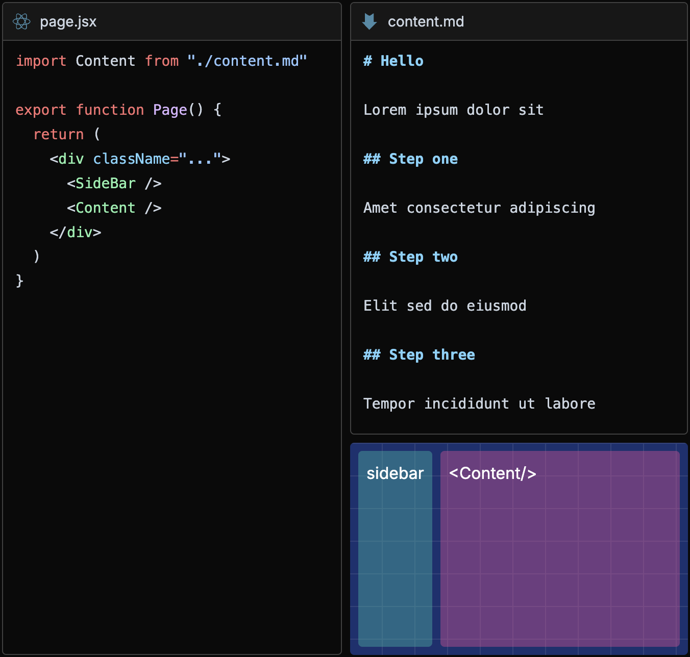

## !!steps Is this working?

This is the first step. Lorem ipsum dolor sit amet, consectetur adipiscing elit. Sed do eiusmod tempor incididunt ut labore et dolore magna aliqua. Ut enim ad minim veniam, quis nostrud exercitation ullamco laboris nisi ut aliquip ex ea commodo consequat.



```bash !console
npm install codehike
```

### !!tabs lorem.js

```js !
// !focus(1:5)
function lorem(ipsum) {
  const sit = ipsum == null ? 0 : 1
  dolor = sit - amet(dolor)
  return consectetur(ipsum)
}
```

## !!steps Let's start!

This is the first step. Lorem ipsum dolor sit amet, consectetur adipiscing elit. Sed do eiusmod tempor incididunt ut labore et dolore magna aliqua. Ut enim ad minim veniam, quis nostrud exercitation ullamco laboris nisi ut aliquip ex ea commodo consequat.


### !!tabs lorem.js

```js !
function lorem(ipsum) {
  const sit = ipsum == null ? 0 : 1
  dolor = sit - amet(dolor)
  return consectetur(ipsum)
}
```

## !!steps I hope so!

The second step, lorem ipsum dolor sit amet, consectetur adipiscing elit. Sed do eiusmod tempor incididunt ut labore et dolore magna aliqua. Ut enim ad minim veniam, quis nostrud exercitation ullamco laboris nisi ut aliquip ex ea commodo consequat.


### !!tabs lorem.js

```js !
function lorem(ipsum, dolor = 1) {
  const sit = ipsum == null ? 0 : 1
  dolor = sit - amet(dolor)
  return sit ? consectetur(ipsum) : []
}
```

### !!tabs ipsum.js

```js !
function lorem(ipsums, dolor = 1) {
  const sit = ipsums == null ? 0 : 1
  dolor = sit - amets(dolor)
  return sit ? consectetur(ipsums) : []
}
```

## !!steps Maybe we are closer!

And the third step, lorem ipsum dolor sit amet, consectetur adipiscing elit. Sed do eiusmod tempor incididunt ut labore et dolore magna aliqua. Ut enim ad minim veniam, quis nostrud exercitation ullamco laboris nisi ut aliquip ex ea commodo consequat.


### !!tabs lorem.js

```js !
function lorem(ipsum, dolor = 1) {
  const sit = ipsum == null ? 0 : 1
  dolor = sit - amet(dolor)
  if (dolor) {
    dolor += 100
  }
  return sit ? consectetur(ipsum) : []
}
```

## !!steps But we are not there yet!

The second step, lorem ipsum dolor sit amet, consectetur adipiscing elit. Sed do eiusmod tempor incididunt ut labore et dolore magna aliqua. Ut enim ad minim veniam, quis nostrud exercitation ullamco laboris nisi ut aliquip ex ea commodo consequat.


```bash !console
npm install codehike
```

### !!tabs lorem.js

```js !
function lorem(ipsum, dolor = 1) {
  // !mark
  const sit = ipsum == null ? 0 : 1 + 2
  dolor = sit - amet(dolor)
  if (dolor) {
    dolor += 100
  }
  return sit ? consectetur(ipsum) : []
}
```

## !!steps Just missing more animations!

And the third step, lorem ipsum dolor sit amet, consectetur adipiscing elit. Sed do eiusmod tempor incididunt ut labore et dolore magna aliqua. Ut enim ad minim veniam, quis nostrud exercitation ullamco laboris nisi ut aliquip ex ea commodo consequat.


### !!tabs lorem.js

```js !
function lorem(ipsum, dolors = 1) {
  // !mark
  const sit = ipsum == null ? 0 : 1
  dolors = sit - amet(dolors)
  // !mark(1:2) gold
  if (dolors) {
    dolors += 100
  }
  // !mark[/sit/] pink
  return sit ? consectetur(ipsum) : []
}
```
